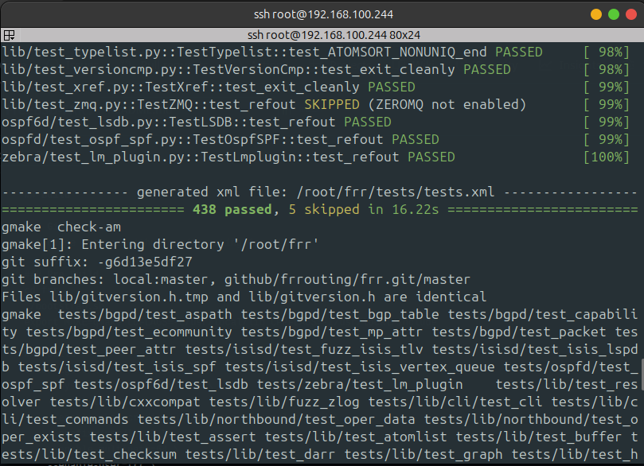
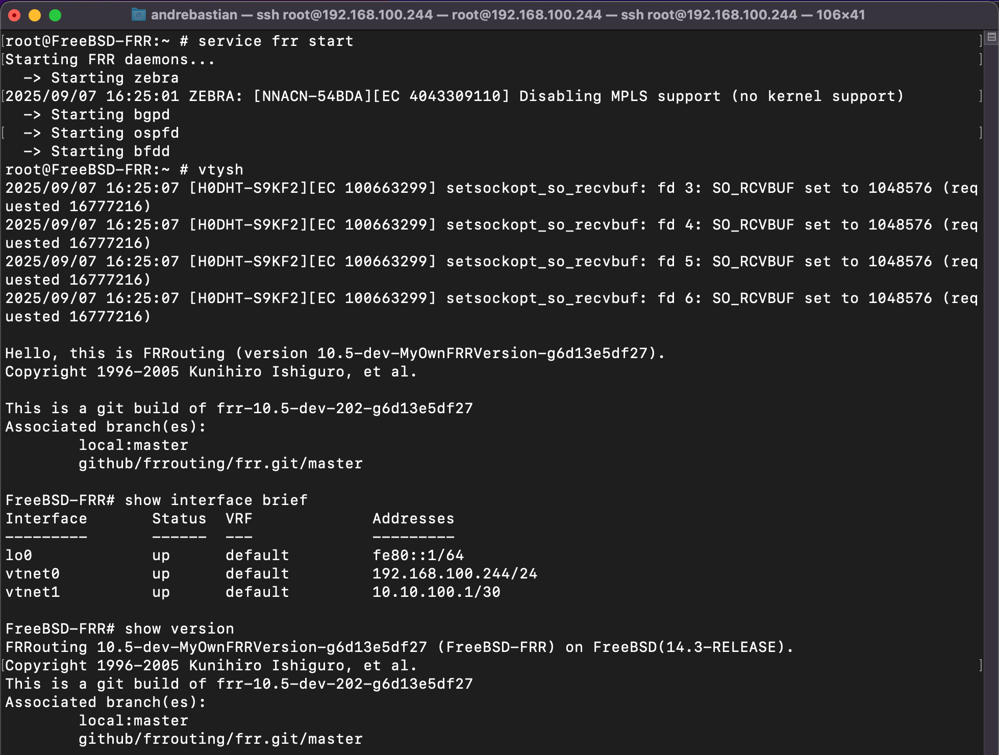
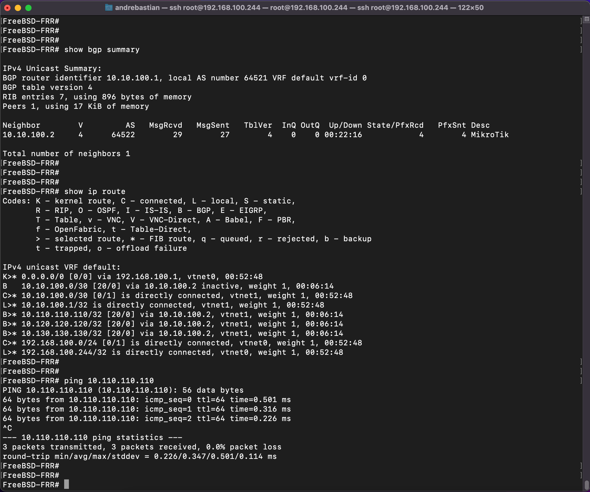
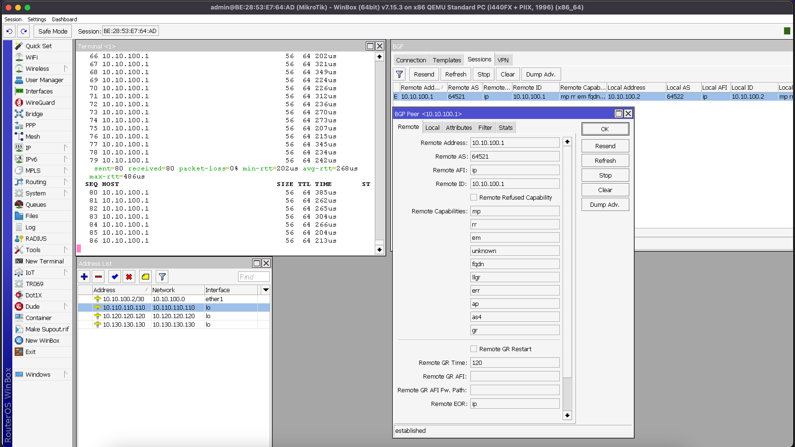

# FreeBSD-FRR

This guide provides step-by-step instructions to build and install FRR (Free Range Routing) on FreeBSD 14.3. It covers package installation, user and group setup, building from source, configuration, and service management.

---

## Prerequisites

In this case we using **FreeBSD 14.3**.

## 1. Install Required Packages

Install all necessary dependencies using `pkg`:

```sh
pkg install autoconf automake bison c-ares git gmake json-c libtool \
    libunwind libyang2 pkgconf protobuf-c texinfo py311-pytest py311-sphinx
```

## 2. Create FRR User and Groups

Create the required groups and user for FRR:

```sh
pw groupadd frr -g 101
pw groupadd frrvty -g 102
pw adduser frr -g 101 -u 101 -G 102 -c "FRR suite" \
   -d /usr/local/etc/frr -s /usr/sbin/nologin
```

## 3. Build FRR from Source

### a. Clone the FRR Repository

```sh
git clone https://github.com/frrouting/frr.git frr
```

### b. Prepare the Build Environment

```sh
cd frr
./bootstrap.sh
export MAKE=gmake LDFLAGS=-L/usr/local/lib CPPFLAGS=-I/usr/local/include
```

### c. Configure the Build

Customize the build for general use with the following parameters:

```sh
./configure \
    --sysconfdir=/usr/local/etc \
    --localstatedir=/var \
    --enable-pkgsrcrcdir=/usr/pkg/share/examples/rc.d \
    --prefix=/usr/local \
    --enable-multipath=64 \
    --enable-user=frr \
    --enable-group=frr \
    --enable-vty-group=frrvty \
    --enable-configfile-mask=0640 \
    --enable-logfile-mask=0640 \
    --enable-fpm \
    --with-pkg-git-version \
    --with-pkg-extra-version=-MyOwnFRRVersion \
    --enable-snmp \
    --enable-fpm \
    --enable-config-rollbacks
```

### d. Build and Install

```sh
gmake
gmake check
gmake install
```




## 4. Configure FRR

### a. Create Configuration Directory and Files

Create the configuration directory and empty config files for each FRR daemons:

```sh
mkdir -p /usr/local/etc/frr
touch /usr/local/etc/frr/babeld.conf
touch /usr/local/etc/frr/bfdd.conf
touch /usr/local/etc/frr/bgpd.conf
touch /usr/local/etc/frr/eigrpd.conf
touch /usr/local/etc/frr/isisd.conf
touch /usr/local/etc/frr/ldpd.conf
touch /usr/local/etc/frr/nhrpd.conf
touch /usr/local/etc/frr/ospf6d.conf
touch /usr/local/etc/frr/ospfd.conf
touch /usr/local/etc/frr/pbrd.conf
touch /usr/local/etc/frr/pimd.conf
touch /usr/local/etc/frr/ripd.conf
touch /usr/local/etc/frr/ripngd.conf
touch /usr/local/etc/frr/staticd.conf
touch /usr/local/etc/frr/zebra.conf
touch /usr/local/etc/frr/vtysh.conf
chown -R frr:frr /usr/local/etc/frr/
chown frr:frrvty /usr/local/etc/frr/vtysh.conf
chmod 640 /usr/local/etc/frr/*.conf
```

### b. Enable IP and IPv6 Forwarding

Edit `/etc/sysctl.conf` and add the following lines to enable packet forwarding:

```
# Routing: Enable IPv4 and IPv6 forwarding
net.inet.ip.forwarding=1
net.inet6.ip6.forwarding=1
```

Reboot the system or apply.

## 5. Enable FRR at Boot

Add the following line to `/etc/rc.conf` to start FRR automatically at boot:

```sh
frr_enable="YES"
```

This is the final `/etc/rc.conf` example to enable FRR and configure IP addresses at boot.

```sh
hostname="FreeBSD-FRR"
sshd_enable="YES"
moused_nondefault_enable="NO"
# Set dumpdev to "AUTO" to enable crash dumps, "NO" to disable
dumpdev="AUTO"
zfs_enable="YES"

# INTERFACE
ifconfig_vtnet0="DHCP descr 'MGMT'"
ifconfig_vtnet1="inet 10.10.100.1 netmask 255.255.255.252 descr 'MikroTik'"


# ENABLE FRR
frr_enable="YES"
```

## 6. Create Runtime and Database Directories

Create the necessary runtime and database directories for FRR:

```sh
mkdir -p /var/run/frr
mkdir -p /var/lib/frr
chown -R frr:frr /var/lib/frr
chown -R frr:frr /var/run/frr
```

## 7. Set Up FRR Service Scripts

### a. Create the rc.d Script

Create `/usr/local/etc/rc.d/frr` with the following content to manage FRR as a service:

```sh
#!/bin/sh
#
# PROVIDE: frr
# REQUIRE: DAEMON
# KEYWORD: shutdown

. /etc/rc.subr

name="frr"
rcvar="frr_enable"

# Path to FRR binaries and configuration
frr_sbindir="/usr/local/sbin"
frr_etcdir="/usr/local/etc/frr"
frr_rundir="/var/run/frr"
frr_libdir="/var/lib/frr"
frr_daemons_file="${frr_etcdir}/daemons"

start_cmd="frr_start"
stop_cmd="frr_stop"
status_cmd="frr_status"

frr_start()
{
    echo "Starting FRR daemons..."
    mkdir -p ${frr_rundir} ${frr_libdir}
    chown frr:frr ${frr_rundir} ${frr_libdir}
    chmod 750 ${frr_rundir} ${frr_libdir}

    if [ ! -f "${frr_daemons_file}" ]; then
        echo "No daemons file found at ${frr_daemons_file}"
        return 1
    fi

    . ${frr_daemons_file}

    for daemon in zebra bgpd ospfd ospf6d ripd ripngd isisd pimd ldpd nhrpd babeld eigrpd bfdd staticd pbrd pathd; do
        eval enabled=\$${daemon}
        if [ "$enabled" = "yes" ]; then
            echo "  -> Starting $daemon"
            ${frr_sbindir}/${daemon} -d -f ${frr_etcdir}/${daemon}.conf -A 127.0.0.1
        fi
    done
}

frr_stop()
{
    echo "Stopping FRR daemons..."
    killall zebra bgpd ospfd ospf6d ripd ripngd isisd pimd ldpd nhrpd babeld eigrpd bfdd staticd pbrd pathd 2>/dev/null
}

frr_status()
{
    echo "Checking FRR daemons..."
    for daemon in zebra bgpd ospfd ospf6d ripd ripngd isisd pimd ldpd nhrpd babeld eigrpd bfdd staticd pbrd pathd; do
        pgrep -x $daemon >/dev/null && echo "  $daemon is running" || echo "  $daemon is stopped"
    done
}

load_rc_config $name
run_rc_command "$1"
```

Make the script executable:

```sh
chmod +x /usr/local/etc/rc.d/frr
```

### b. Create the Daemons Configuration File

Create `/usr/local/etc/frr/daemons` to specify which FRR daemons to start
For example, we enable zebra as the main daemon, along with BGP, OSPF, and BFD.

```
# Daemons configuration for FRR
zebra=yes
bgpd=yes
ospfd=yes
bfdd=yes
ospf6d=no
ripd=no
ripngd=no
isisd=no
ldpd=no
pimd=no
nhrpd=no
eigrpd=no
babeld=no
pbrd=no
pathd=no
snmpd=no
```

## 8. Start FRR

After rebooting, start the FRR service:

```sh
service frr start
```

To access the FRR integrated shell, use:

```sh
vtysh
```



---

**Note:**  
- Adjust the list of enabled daemons in `/usr/local/etc/frr/daemons` according to your routing requirements.
- Ensure all configuration files have the correct permissions and ownership for security.
---

## 9. Testing
For testing, we established a BGP session between FRR and MikroTik. The BGP session was successfully established, and FRR received several prefix from MikroTik.

### FRR



### MikroTik



---

## Links

Origin : 
[\[https://github.com/andre4freelance/FreeBSD-FRR](https://github.com/andre4freelance/FreeBSD-FRR)

Linkedin post : 
[\[https://www.linkedin.com/posts/link-andre-bastian_networking-opensource-freebsd-activity-7371985165218181121-szi9?utm_source=share&utm_medium=member_desktop&rcm=ACoAAD73JlUBty-p-mBfMEW0-O4j0sv-e_PRQvc](https://www.linkedin.com/posts/link-andre-bastian_networking-opensource-freebsd-activity-7371985165218181121-szi9?utm_source=share&utm_medium=member_desktop&rcm=ACoAAD73JlUBty-p-mBfMEW0-O4j0sv-e_PRQvc)
